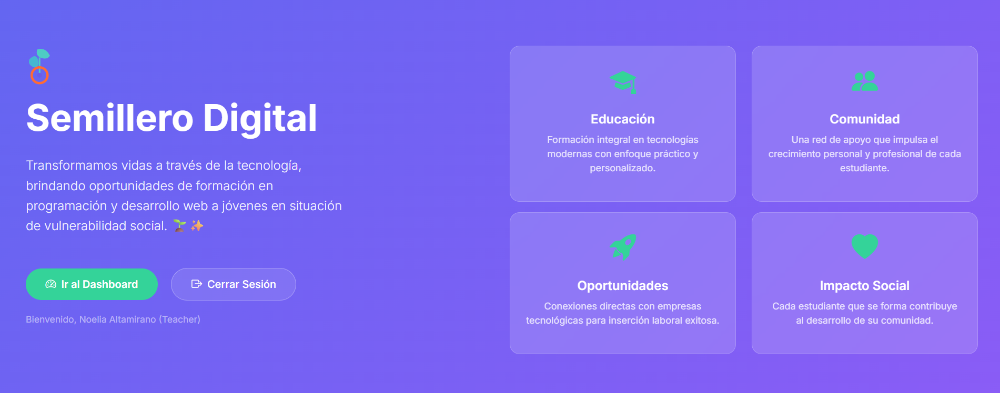
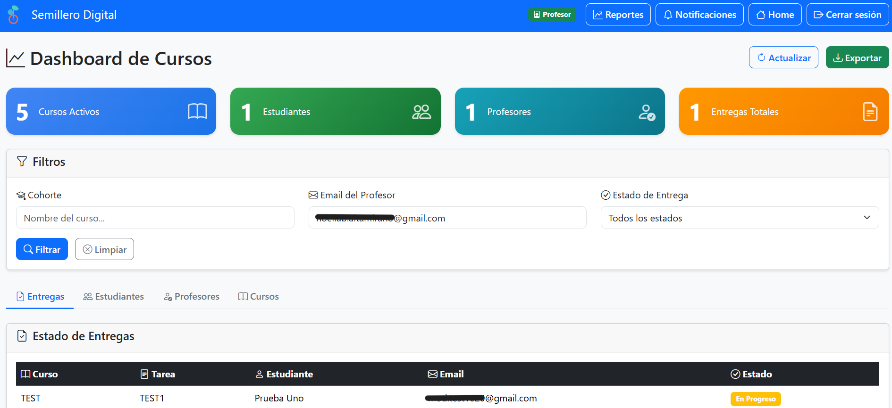
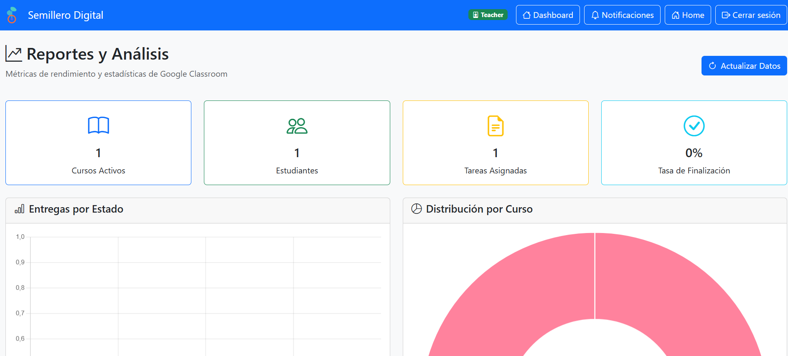
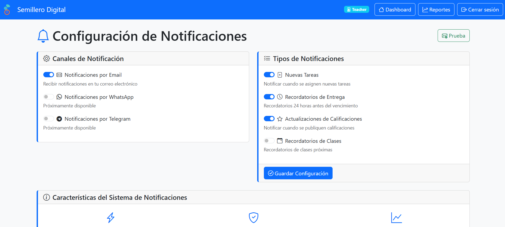

# 🎓 EduFlow Dashboard - Semillero Digital

  

**EduFlow: Optimizando el flujo de trabajo, información y comunicación en el ecosistema educativo de Semillero Digital.**

---

**Demo en vivo:** [https://semillero-digital-dashboard.onrender.com](https://semillero-digital-dashboard.onrender.com)

Un dashboard de análisis y gestión en tiempo real para Google Classroom, diseñado para potenciar la experiencia educativa de Semillero Digital con automatización, métricas avanzadas y una interfaz profesional.

## 🖼️ Galería del Proyecto

<table>
  <tr>
    <td align="center"><strong>Página de Inicio</strong></td>
    <td align="center"><strong>Dashboard Principal</strong></td>
  </tr>
  <tr>
    <td></td>
    <td></td>
  </tr>
  <tr>
    <td align="center"><strong>Reportes Avanzados</strong></td>
    <td align="center"><strong>Gestión de Notificaciones</strong></td>
  </tr>
  <tr>
    <td></td>
    <td></td>
  </tr>
</table>

## 🚀 Características Principales

### 📊 **Dashboard Inteligente**
- **Métricas Clave en Tiempo Real**: Visualiza cursos, estudiantes, y el estado de todas las entregas de un solo vistazo.
- **4 Vistas Esenciales**: Entregas, Estudiantes, Profesores y Cursos, todo en un solo lugar.
- **Filtros Funcionales**: Filtra la información por cohorte, email del profesor o estado de la entrega para un análisis granular.
- **Gráficos Interactivos**: Visualizaciones dinámicas con Chart.js que facilitan la comprensión del progreso.
- **Exportación a CSV**: Descarga los datos de entregas para análisis offline.

### 🔔 **Sistema de Notificaciones Automáticas**
- **Recordatorios Inteligentes**: Envía emails automáticos a los estudiantes 24 horas antes del vencimiento de una tarea.
- **Verificación Constante**: Un scheduler revisa cada hora si hay nuevas tareas por vencer, garantizando que ninguna notificación se pierda.
- **Templates Profesionales**: Comunicaciones por email con formato HTML y branding de Semillero Digital.
- **Botón de Prueba**: Verifica la configuración del sistema de correo con un solo clic.

### 📈 **Reportes Gráficos Avanzados**
- **Análisis de Rendimiento**: Métricas por cohorte para evaluar el desempeño general.
- **Estadísticas Detalladas**: Gráficos de dona y barras que muestran la proporción de entregas a tiempo vs. tardías.
- **Progreso Visual**: Tablas enriquecidas con barras de progreso para un seguimiento intuitivo.

### 👥 **Sistema de Roles Oficiales de Google Classroom**
- **Detección Automática de Roles**: Identifica si un usuario es `Teacher` o `Student` basándose en su participación real en los cursos.
- **Vistas Adaptativas**: La interfaz se ajusta automáticamente, mostrando la información relevante para cada rol.
- **Permisos Seguros**: La lógica de negocio respeta la jerarquía de permisos de la API de Google.

### 🎨 **Diseño y Experiencia de Usuario (UX)**
- **Identidad Visual Profesional**: Página de inicio con logo SVG animado y diseño `glassmorphism`.
- **Interfaz Moderna**: Construido con Bootstrap 5, es completamente responsive y luce genial en cualquier dispositivo.
- **Rendimiento Optimizado**: Un sistema de caché inteligente reduce los tiempos de carga, con opción de limpieza manual para obtener datos frescos al instante.

## 🛠️ Tecnologías Utilizadas

| Categoría | Tecnologías |
| :--- | :--- |
| **Backend** | Python, FastAPI, APScheduler |
| **Frontend** | HTML5, CSS3, JavaScript, Bootstrap 5, Chart.js, Jinja2 |
| **APIs y Autenticación** | Google Classroom API, Google People API, Google Calendar API, OAuth 2.0 |
| **Despliegue** | Docker, Render, Gunicorn |
| **Base de Datos** | En memoria (para sesiones y caché) |

## 🚀 Despliegue y Configuración

### 1. Despliegue con Render
La forma más sencilla de desplegar este proyecto es usando el botón "Deploy to Render". Render clonará el repositorio y usará el `Dockerfile` para construir y desplegar la aplicación automáticamente.

### 2. Configuración de Variables de Entorno
Para que la aplicación funcione, debes configurar las siguientes variables de entorno en tu servicio de hosting (ej. Render):

#### Credenciales de Google:
- `GOOGLE_CLIENT_ID`: El Client ID de tu aplicación en Google Cloud Console.
- `GOOGLE_CLIENT_SECRET`: El Client Secret correspondiente.
- `SECRET_KEY`: Una clave secreta larga y aleatoria para firmar las sesiones.
- `REDIRECT_URI`: La URL de callback de OAuth (ej: `https://tu-app.onrender.com/oauth/callback`).

#### Configuración de Notificaciones por Email (SMTP):
Para que el envío de emails funcione, necesitas configurar un servidor SMTP.

| Variable | Descripción | Ejemplo |
| :--- | :--- | :--- |
| `MAIL_USERNAME` | Tu dirección de correo (Gmail, etc.) | `tu.email@gmail.com` |
| `MAIL_PASSWORD` | **Contraseña de Aplicación** generada | `abcd efgh ijkl mnop` |
| `MAIL_FROM` | El mismo email que el username | `tu.email@gmail.com` |
| `MAIL_SERVER` | Servidor SMTP | `smtp.gmail.com` |
| `MAIL_PORT` | Puerto del servidor (TLS) | `587` |
| `MAIL_TLS` | Habilitar TLS | `True` |
| `MAIL_SSL` | Habilitar SSL | `False` |

> **Nota sobre la Contraseña de Aplicación:** Si usas Gmail con verificación en dos pasos, debes generar una "Contraseña de Aplicación" desde la configuración de seguridad de tu cuenta de Google. No uses tu contraseña principal.

## 🎯 Problemas Resueltos

Este dashboard fue diseñado para resolver los **3 problemas centrales** de la gestión académica en Semillero Digital:

1.  **Seguimiento Ineficiente del Progreso:** Reemplaza la revisión manual y las hojas de cálculo con un dashboard centralizado y en tiempo real.
2.  **Comunicación Reactiva y Lenta:** Automatiza la comunicación proactiva con los estudiantes a través de recordatorios inteligentes, mejorando las tasas de entrega.
3.  **Falta de Métricas para la Toma de Decisiones:** Proporciona a los coordinadores reportes y análisis visuales para evaluar el rendimiento y planificar estratégicamente.

## 📄 Licencia

Este proyecto está bajo la Licencia MIT. Ver el archivo `LICENSE` para más detalles.
